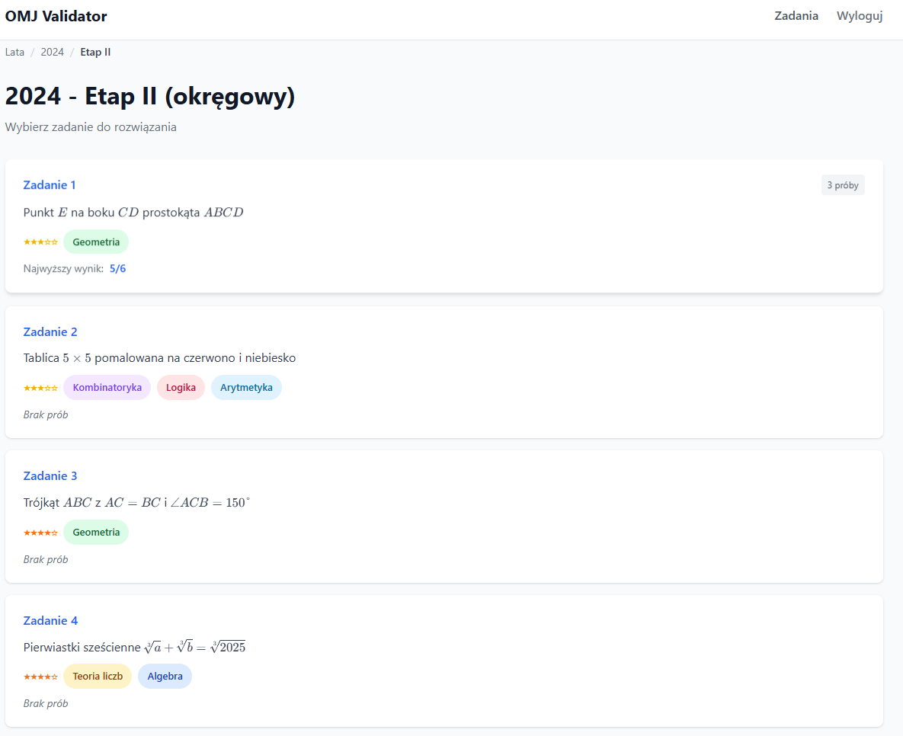
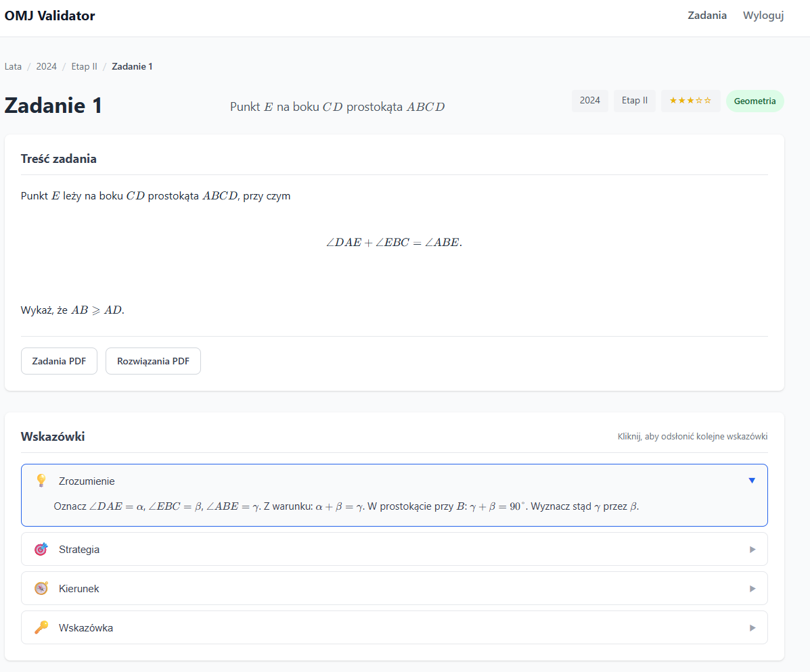
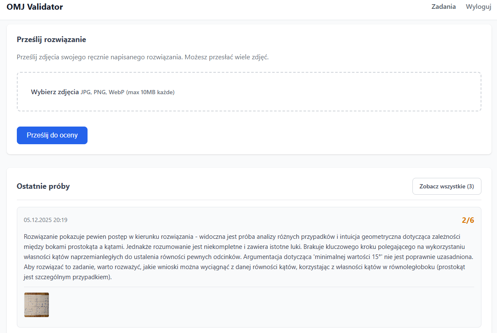

# OMJ Validator

Aplikacja webowa do sprawdzania rozwiązań zadań z Olimpiady Matematycznej Juniorów. Uczniowie mogą przesyłać zdjęcia swoich odręcznych rozwiązań, które są analizowane przez AI na podstawie oficjalnych zadań PDF i kryteriów oceniania.

## Zrzuty ekranu

| Lista zadań | Szczegóły zadania | Ocena rozwiązania |
|:-----------:|:-----------------:|:-----------------:|
|  |  |  |

## Funkcje

- Przeglądanie 20 lat zadań OMJ/OMG (2005-2025)
- Przesyłanie odręcznych rozwiązań do oceny przez AI
- Punktacja zgodna z oficjalnymi kryteriami OMJ (0, 2, 5, 6 pkt dla etapu 2; 0, 1, 3 dla etapu 1)
- System progresywnych wskazówek pomagających w nauce
- Renderowanie LaTeX dla notacji matematycznej
- Metadane zadań: poziom trudności i kategorie

## Szybki start

```bash
# Zainstaluj zależności
pip install -r requirements.txt

# Skopiuj i skonfiguruj środowisko
cp .env.example .env
# Edytuj .env - ustaw AUTH_KEY i GEMINI_API_KEY

# Uruchom serwer
./start.sh
# Lub: uvicorn app.main:app --reload --host 0.0.0.0 --port 8000
```

## Konfiguracja

Zmienne środowiskowe (`.env`):

| Zmienna | Opis |
|---------|------|
| `AUTH_KEY` | Klucz dostępu do aplikacji |
| `GEMINI_API_KEY` | Klucz API Google Gemini do analizy rozwiązań |
| `GEMINI_MODEL` | Model do użycia (domyślnie: `gemini-3-pro-preview`) |
| `AI_PROVIDER` | Dostawca AI (obecnie tylko `gemini`) |

## Źródła materiałów

Projekt wykorzystuje materiały konkursowe **Olimpiady Matematycznej Juniorów (OMJ)**.

- **Organizator**: [Stowarzyszenie na rzecz Edukacji Matematycznej (SEM)](https://sem.edu.pl)
- **Oficjalna strona**: [omj.edu.pl](https://omj.edu.pl)
- **Finansowanie**: Ministerstwo Edukacji Narodowej

Zadania i rozwiązania konkursowe (pliki PDF w katalogu `tasks/`) są własnością © Stowarzyszenie na rzecz Edukacji Matematycznej. Materiały te są publicznie dostępne na stronie [omj.edu.pl/zadania](https://omj.edu.pl/zadania) w celach edukacyjnych.

**Ten projekt jest niezależnym narzędziem edukacyjnym i nie jest powiązany z SEM ani OMJ.**

## Licencja

Licencja MIT - szczegóły w pliku [LICENSE](LICENSE).

Materiały konkursowe OMJ (pliki PDF) zachowują swoje oryginalne prawa autorskie zgodnie z powyższymi informacjami.
