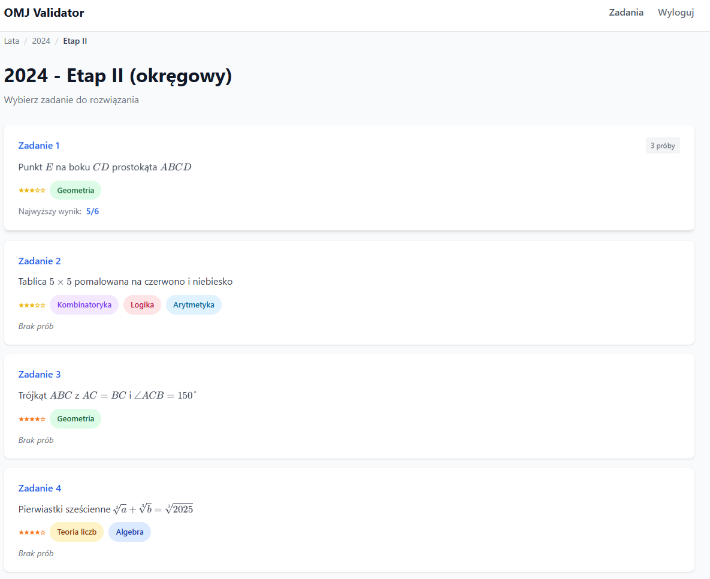
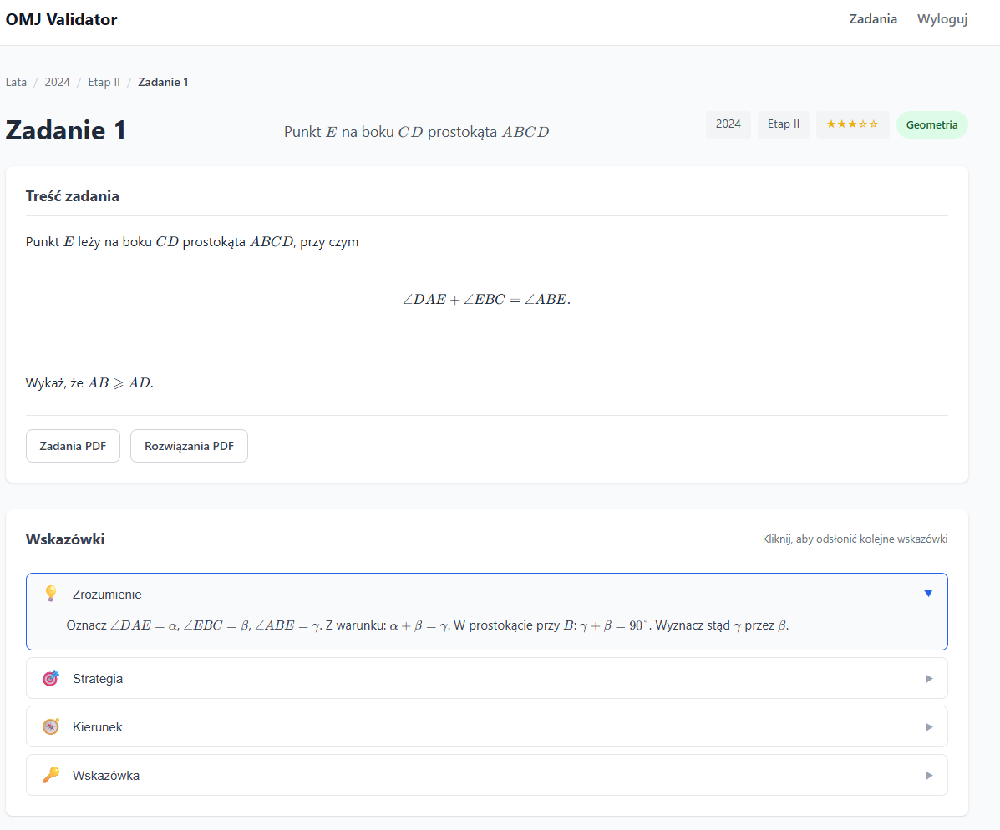
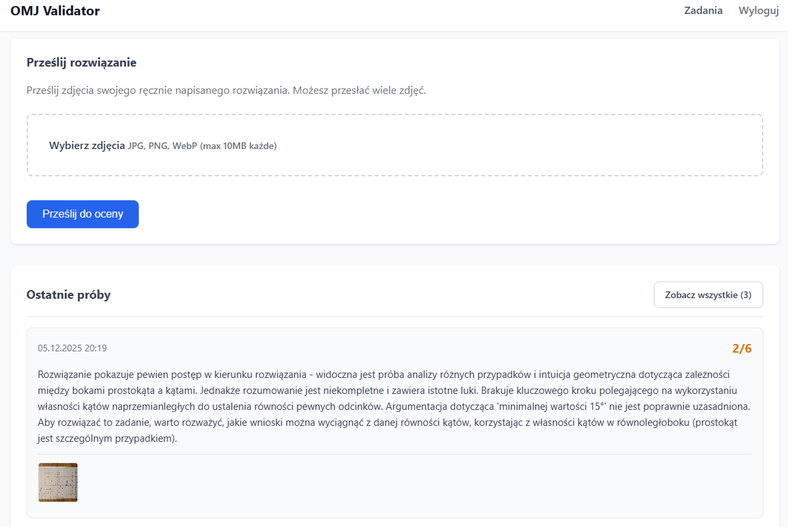

# OMJ Validator

Aplikacja webowa do sprawdzania rozwiązań zadań z Olimpiady Matematycznej Juniorów. Uczniowie mogą przesyłać zdjęcia swoich odręcznych rozwiązań, które są analizowane przez AI na podstawie oficjalnych zadań PDF i kryteriów oceniania.

## Zrzuty ekranu

| Lista zadań | Szczegóły zadania | Ocena rozwiązania |
|:-----------:|:-----------------:|:-----------------:|
|  |  |  |

## Funkcje

- Przeglądanie 20 lat zadań OMJ/OMG (2005-2025)
- Przesyłanie odręcznych rozwiązań do oceny przez AI
- Punktacja zgodna z oficjalnymi kryteriami OMJ (0, 2, 5, 6 pkt dla etapu 2; 0, 1, 3 dla etapu 1)
- System progresywnych wskazówek pomagających w nauce
- Renderowanie LaTeX dla notacji matematycznej
- Metadane zadań: poziom trudności i kategorie

## Szybki start

> **Ważne:** materiały OMJ (pliki PDF i treści zadań) **nie są częścią tego
> repozytorium** — pobierasz je samodzielnie z oficjalnego źródła. Szczegóły
> w sekcji [Źródła materiałów](#źródła-materiałów) i w pliku [NOTICE](NOTICE).

```bash
# 1. Sklonuj repozytorium i zainstaluj zależności
git clone https://github.com/rsokolowski/omj-validator.git
cd omj-validator
pip install -r requirements.txt

# 2. Skonfiguruj środowisko
cp .env.example .env
# Edytuj .env - ustaw co najmniej GEMINI_API_KEY

# 3. Pobierz zadania z omj.edu.pl (~80 MB, ~170 plików PDF)
python download_tasks.py --all-etaps

# 4. (opcjonalnie) Wygeneruj treści zadań z PDF-ów - wymaga Claude CLI
#    Trwa długo (62 wywołania modelu). Bez tego kroku aplikacja działa,
#    ale zamiast treści zadania pokazuje odnośnik do PDF-u.
python fix_latex_content.py --all --skip-existing

# 5. Uruchom całość (PostgreSQL + backend + frontend w Dockerze)
./start.sh
```

Frontend: http://localhost:3000, backend: http://localhost:8000.

Kroki 3 i 4 są idempotentne — możesz je uruchamiać ponownie, np. po ogłoszeniu
nowej edycji olimpiady. Pobrane pliki nie są nadpisywane (chyba że użyjesz
`--force`), a już wygenerowane treści są pomijane (`--skip-existing`).

### Co działa bez kroków 3 i 4?

| | bez PDF-ów | z PDF-ami (krok 3) | + treści (krok 4) |
|---|:---:|:---:|:---:|
| Lista lat, etapów i zadań | tak | tak | tak |
| Metadane: trudność, kategorie, wskazówki, wymagania wstępne | tak | tak | tak |
| Odnośnik do PDF-u z zadaniami i rozwiązaniami | nie | tak | tak |
| Treść zadania w LaTeX-u na stronie | nie | nie | tak |
| Ocena przesłanego rozwiązania przez AI | nie | tak | tak |

Ocena rozwiązania korzysta z PDF-ów (zadania + oficjalne rozwiązania), a nie
z przepisanej treści, dlatego krok 4 jest wyłącznie kwestią wygody czytania.

## Konfiguracja

Zmienne środowiskowe (`.env`):

| Zmienna | Opis |
|---------|------|
| `AUTH_KEY` | Klucz dostępu do aplikacji |
| `GEMINI_API_KEY` | Klucz API Google Gemini do analizy rozwiązań |
| `GEMINI_MODEL` | Model do użycia (domyślnie: `gemini-3.8-flash`) |
| `AI_PROVIDER` | Dostawca AI (obecnie tylko `gemini`) |

## Źródła materiałów

Projekt korzysta z materiałów konkursowych **Olimpiady Matematycznej Juniorów (OMJ)**.

- **Organizator**: [Stowarzyszenie na rzecz Edukacji Matematycznej (SEM)](https://sem.edu.pl)
- **Oficjalna strona**: [omj.edu.pl](https://omj.edu.pl)
- **Finansowanie**: Ministerstwo Edukacji Narodowej

**Materiały OMJ nie są częścią tego repozytorium i nie są wraz z nim
rozpowszechniane.** Treści zadań, rozwiązania i pliki PDF są własnością ich
autorów oraz organizatora olimpiady. Autor tego projektu nie ma prawa udzielać
na nie licencji, a publiczna licencja zezwalająca na ich redystrybucję nie
istnieje. Dlatego każdy, kto uruchamia aplikację, pobiera je samodzielnie
z oficjalnego źródła:

| Katalog | Zawartość | Skąd się bierze | W repozytorium? |
|---------|-----------|-----------------|-----------------|
| `tasks/` | PDF-y OMJ: zadania, rozwiązania, statystyki | `python download_tasks.py --all-etaps` | nie (`.gitignore`) |
| `data/task_content/` | treści zadań przepisane z PDF-ów do LaTeX-a | `python fix_latex_content.py --all` | nie (`.gitignore`) |
| `data/tasks/` | metadane: trudność, kategorie, wskazówki, wymagania wstępne, umiejętności | własna twórczość autora | tak |

**Ten projekt jest niezależnym narzędziem edukacyjnym i nie jest powiązany z SEM ani OMJ.**

## Licencja

Licencja MIT — szczegóły w pliku [LICENSE](LICENSE).

Licencja obejmuje kod źródłowy oraz wygenerowane przez autora metadane zadań
(`data/tasks/`). **Nie obejmuje** treści zadań, rozwiązań ani plików PDF
Olimpiady Matematycznej Juniorów — te są własnością ich autorów i organizatora
(Stowarzyszenie na rzecz Edukacji Matematycznej, [omj.edu.pl](https://omj.edu.pl))
i nie są rozpowszechniane wraz z repozytorium.

Pełne omówienie zakresu licencji znajduje się w pliku [NOTICE](NOTICE).
